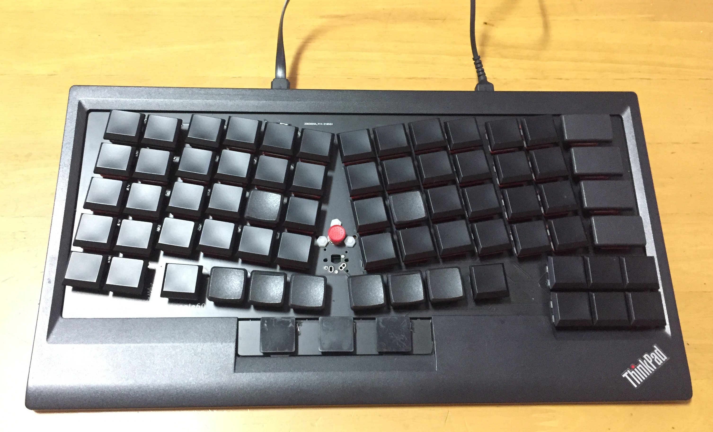

# pineapple60
ergonomic keyboard with Trackpoint

The purposes of this project.
- Install inside ThinkPad T470s (compatible with T460s)
- Install inside the Trackpoint keyboard (KU-1255 ~~and KT-1255~~)

(They are alomost same size.)

## p60X
Variable key layout board for researching ergonomic keyboard layouts

< 2021-09 coming soon >

## p50V
V-style key layout [board](p50V/README.md)

2021-08 installed on my T470s

## p60-03
third prototype [pcb](p60-03/README.md)

2021-05 p60-03b 

[how to make the ergonomic Trackpoint keyboard](how_to_make_ergonomic_trackpoint_keyboard.md)

## p4
2021-03 key layout testing [module](p4/README.md)

## p60-02
2020-12 second prototype [pcb](p60-02/README.md)

## p60-01
2020-10 first prototype [pcb](p60-01/README.md)

## SNS
https://twitter.com/saoto28

https://www.reddit.com/user/saoto28/posts/