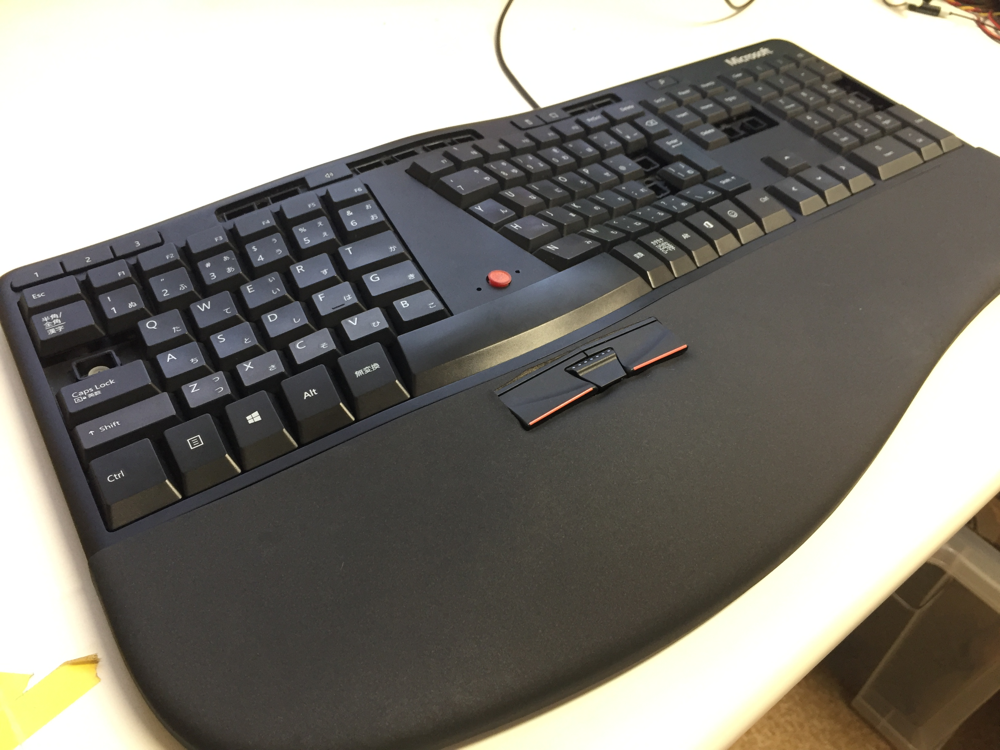
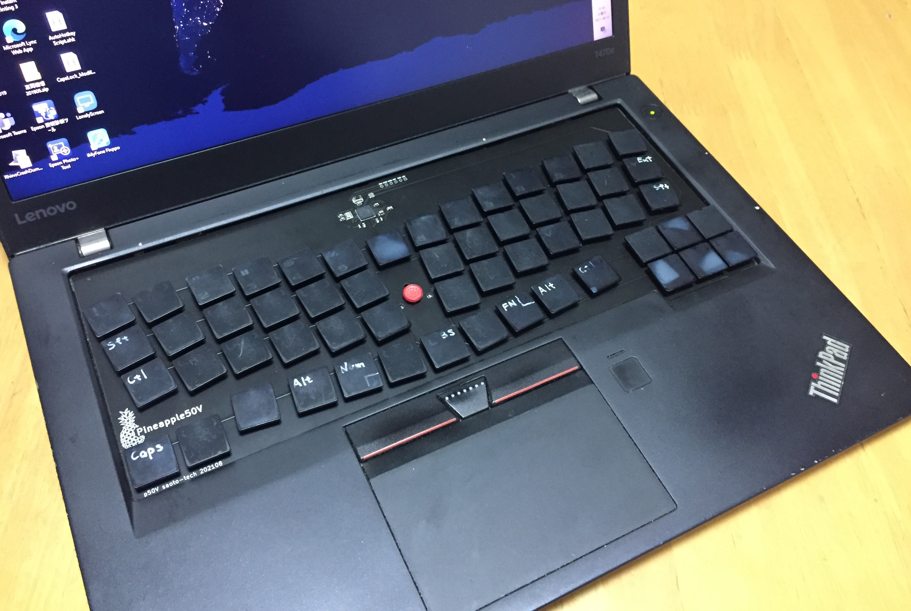
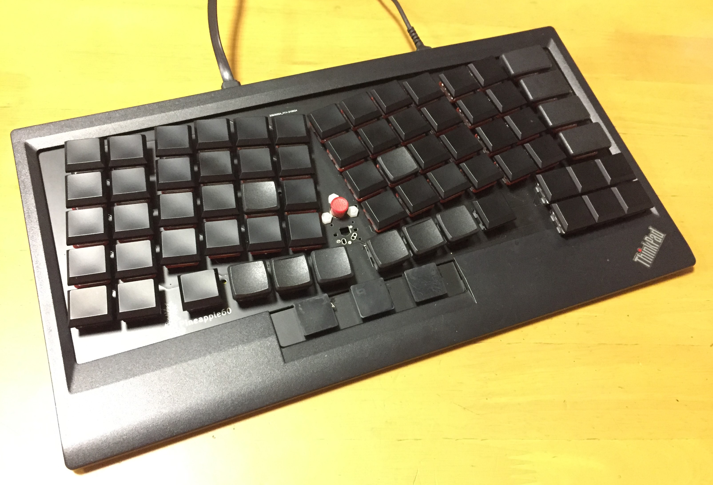
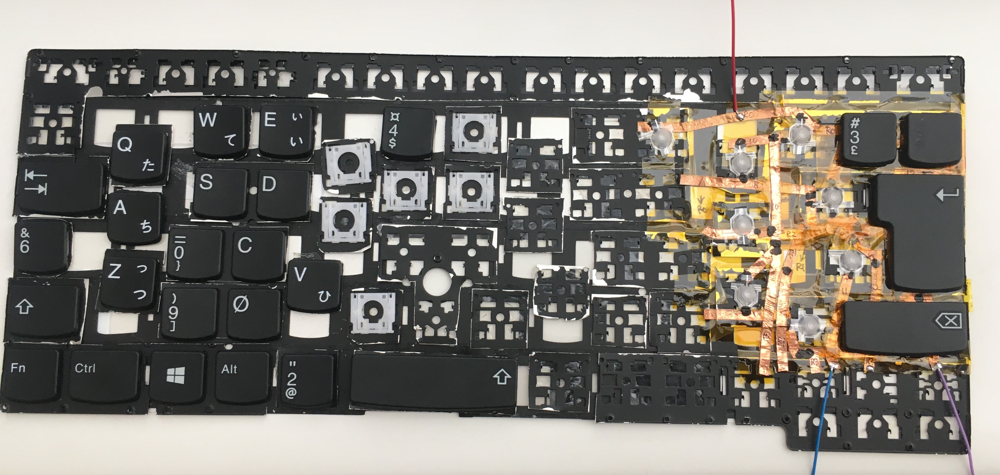

# pineapple60
ergonomic keyboard with Trackpoint

The purposes of this project.
- Install it in ThinkPad

## p60S
2025 new project

Row-Staggered Ergonomic keyboard with Kailh PG1316 for installing ThinkPad X13 Gen2

## p0

Extra edition. Trackpoint module installation.

2021-10 Add the Trackpoint module of ThinkPad X100 on the Microsoft Ergonomic Keyboard.

[How to install the Trackpoint module in the MS ergonomic keyboard](p0/How_to_modify_MS_ergonomic_keyboard.pdf)

~~## p60X~~

~~Variable key layout board for researching ergonomic keyboard layouts~~

~~< 2021-09 coming soon >~~

## p50V

V-style key layout [board](p50V/README.md)

2021-08 installed on my T470s

## p60-03

third prototype [pcb](p60-03/README.md)

2021-05 p60-03b 

[how to make the ergonomic Trackpoint keyboard](how_to_make_ergonomic_trackpoint_keyboard.md)

## p4

2021-03 key layout testing [module](p4/README.md)

## p60-02

2020-12 second prototype [pcb](p60-02/README.md)

## p60-01

2020-10 first prototype [pcb](p60-01/README.md)

## pre-pineapple

2020-08 I tried to make an ergonomic keyboard for my ThinkPad T470s, by disassembling and modifying the spare keyboard. But, gave up.

## SNS

https://twitter.com/saoto28

https://www.reddit.com/user/saoto28/posts/