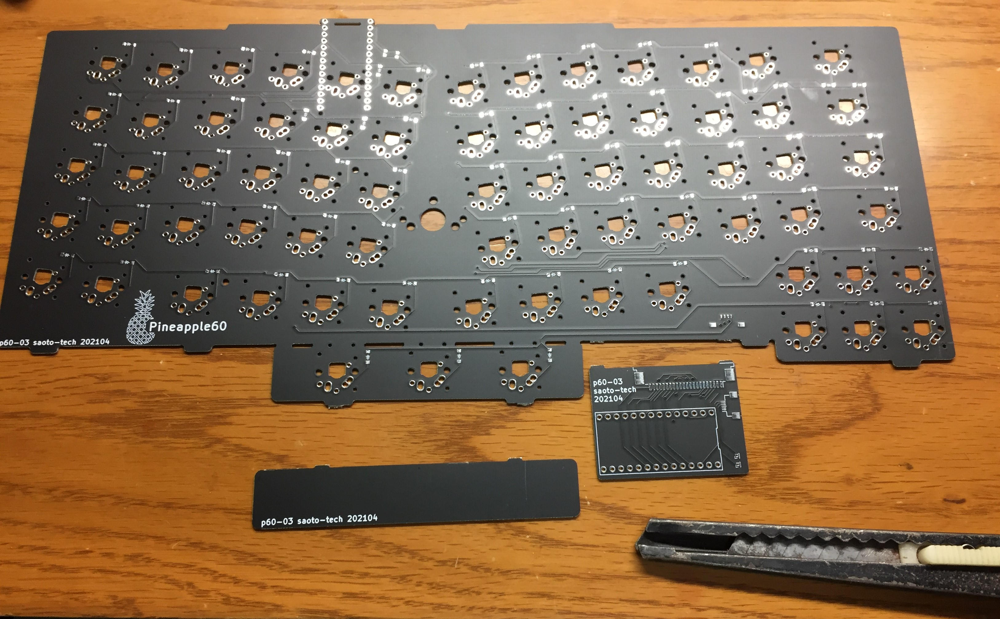
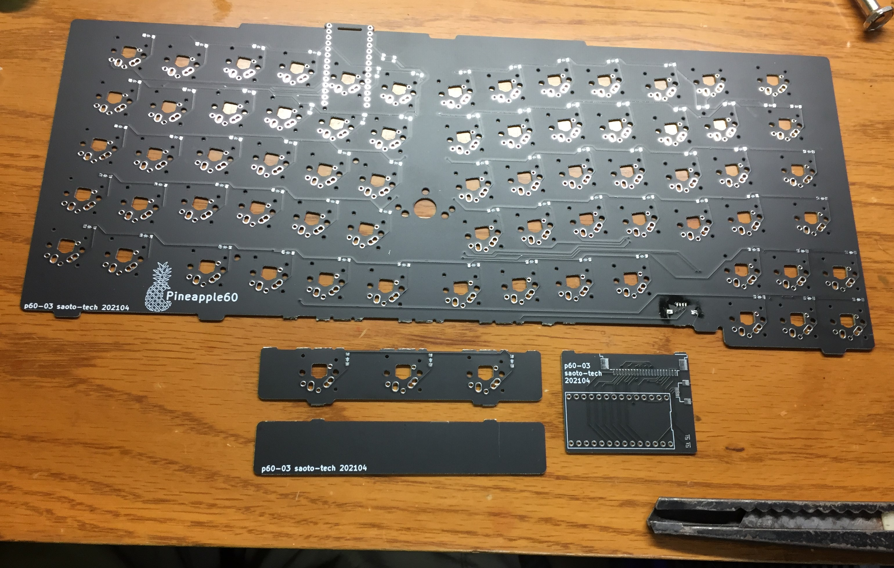
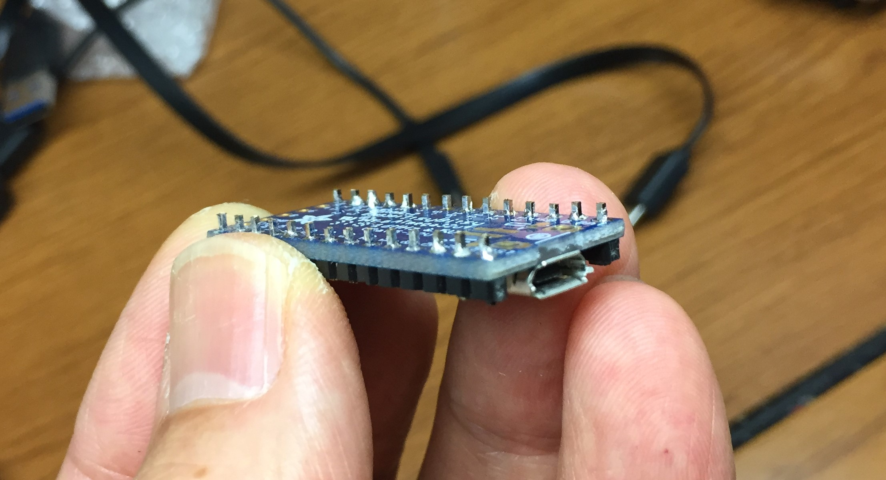
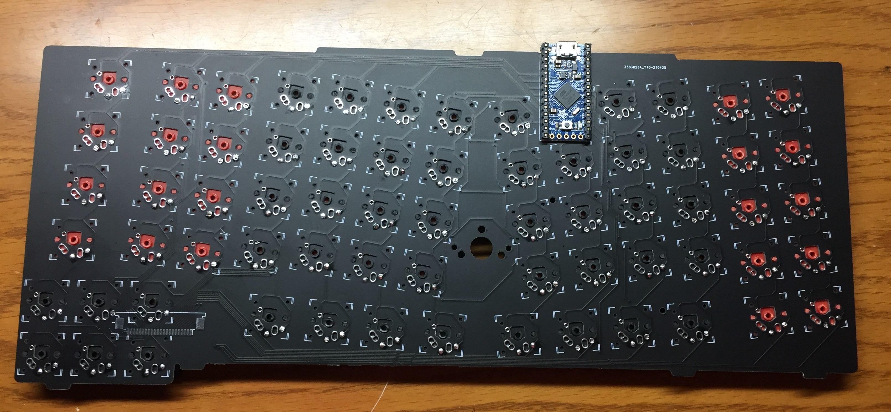

# How to make the ergonomic Trackpoint keyboard with P60-03

## Parts list
- PCB: Pineapple60-03
- MCU: Adafruit ItsyBitsy 32u4
- Key switches: Kaih [choc](https://www.kailhswitch.com/mechanical-keyboard-switches/low-profile-key-switches/linear-mechanical-keyboard-switches.html)
- Keycaps
- SMD Diodes: 1N4148W or similar
- Tactile switch: C&K [KMR231NG LFS](https://www.digikey.jp/product-detail/ja/c-k/KMR231NG-LFS/CKN10246CT-ND/2176497) or compatible
- Base keyboard: Lenovo ThinkPad Compact USB Keyboard with TrackPoint [KU-1255/0B47190](https://support.lenovo.com/us/en/solutions/pd026745-thinkpad-compact-usb-keyboard-with-trackpoint-overview-and-service-parts)
- Trackpoint cap: by [Saoto-Tech](https://www.etsy.com/shop/SaotoTech) (option)

When you don't use the original mouse button switches,
- 3 additional key switches: Kailh chocs or X-switches w/caps
- FFC connector: Molex [WM20760CT-ND](https://www.digikey.com/en/products/detail/molex/2005280040/6099554) or compatible
- FFC cable: [4pos, 1.0mm pitch, 100mm length](https://www.digikey.com/en/products/detail/w%C3%BCrth-elektronik/686704100001/4573338) or Compatible

## Assemble the board
Cut the pcb. 
If you don't use the original mouse button switches of the keyboard, don't remove the base plate of three mouse switches. 

When you use the original mouse switches of the keyboard, remove the base.

How to put the diodes.

(1)Put some solder on one side.

(2)Solder one side of the diode.

(3)Solder another side of the diode.

How to put the key switches.

(1)Solder

(2)Cut the all protrusions. In this time, push the key switch.

(3)The inside shaft also cut.

At first, put a key switch on "R" position.

Put insulating tape on the back side.

Solder the pin legs to the MCU.

Then, put the MCU on the PCB.

At last,

Don't forget a tactile switch on the top as a reset switch.

## Install the software

## disassemble the Thinkpad Compact keyboard

## Install the keyboard in the ThinkPad

## When you don't use the original mouse button switches of the Thinkpad keyboard