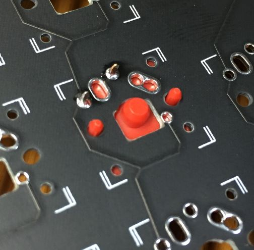
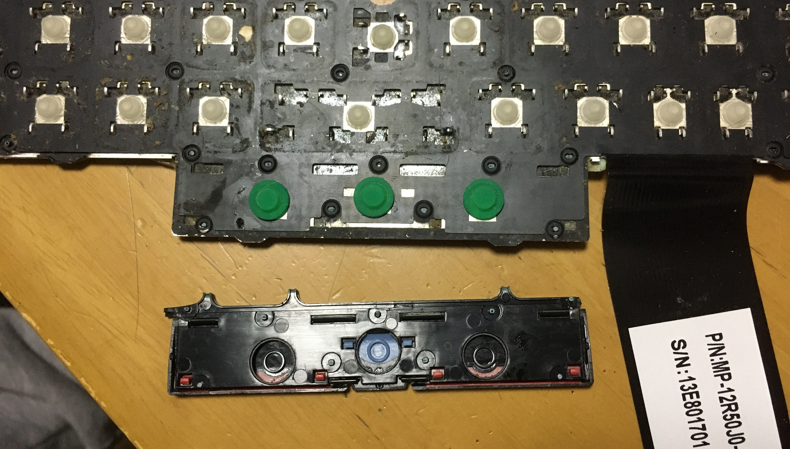

# How to make the ergonomic Trackpoint keyboard with P60-03b

## Parts list
- Base keyboard: Lenovo ThinkPad Compact USB Keyboard with TrackPoint [KU-1255/0B47190](https://support.lenovo.com/us/en/solutions/pd026745-thinkpad-compact-usb-keyboard-with-trackpoint-overview-and-service-parts) x 1 pcs

    (You can not install this PCB in the Bluetooth Keyboard [KT-1255], because the MCU position was used for the battery.)

- PCB: [Pineapple60-03b](https://www.etsy.com/shop/SaotoTech) x 1 pcs
- MCU: Adafruit [ItsyBitsy 32u4](https://learn.adafruit.com/introducting-itsy-bitsy-32u4) - 5V x 1 pcs

    (3.3V type is not usable. Because the #5 pin is a special output-only pin.)
- Key switches: Kaih [choc](https://www.kailhswitch.com/mechanical-keyboard-switches/low-profile-key-switches/linear-mechanical-keyboard-switches.html) x 68 pcs

    (The choc is higher than the original key switch. The Kailh [X Switch](https://www.kailhswitch.com/mechanical-keyboard-switches/low-profile-key-switches/thin-notebook-mechanical-key-switch.html) is similar height as the original. But, expensive)
- Keycaps x68 pcs
- SMD Diodes: 1N4148W or similar SOD123 type x 68 pcs
- Reset switch: C&K [KMR211NG LFS](https://www.digikey.com/en/products/detail/c-k/KMR211NG-LFS/2176494) or compatible x 1 pcs

- bolts and nuts for fixing the Trackpoint module: M2.5 x 3mm x 3 sets
- Trackpoint cap: by [Saoto-Tech](https://www.etsy.com/shop/SaotoTech) (optional) x 1pcs
- etc: Kapton tape, double-sided tape, solder 

When you don't use the original mouse button switches,
- additional key switches: Kailh chocs or X-switches w/caps x 3 pcs
- FFC connector:  	Würth Elektronik  [686104183522](https://www.digikey.jp/product-detail/en/w%C3%BCrth-elektronik/686104183522/732-11326-1-ND/7087352) or compatible x 1 pcs
- FFC cable: [4pos, 1.0mm pitch, more than 115mm length](https://www.digikey.jp/product-detail/en/molex/0152670709/WM22903-ND/4427461) or Compatible x 1 pcs

## Side view
### with Kailh choc switches

### with Kailh X-switches

## Assemble the board
Cut the pcb. 
If you don't use the original mouse button switches of the keyboard, don't remove the base plate of three mouse switches. 

When you use the original mouse switches of the keyboard, remove the base.
(But, using the original mouse switches is quite troublesome. See this how-to at first)
(This pic is p60-03)

### How to put the diodes.

(1)Put some solder on one side.

(2)Solder one side of the diode. Attention the orientation.

(3)Solder another side of the diode.

### How to put the key switches.

(1)Solder

(2)Cut the all protrusions. In this time, push the key switch fully.

(3)The inside shaft also cut.

### How to put the MCU

put a key switch on "R" position that is the MCU position.

Attention: It is very difficult to exchange the key switch after putting the MCU. Make the key switch connection sure.

Put insulating tape on the back side. And put some solder on a pad of the MCU.

Put the MCU, and solder the pad.

(This pic shows 32u4 - 3V type that is not usable.)

After soldering all pads, you should check all connections by the tester. Actually, we don't need bottom 5 pad connections.

Put a reset switch

At last,

(It is ver. p60-03)

ver. p60-03b has a footprint for the center key switch. When putting the key switch, it is necessary to modify the keycap to avoid interference with the Trackpoint.

## disassemble the Thinkpad Compact keyboard

Open the Trackpoint keyboard. Just pull up the frame. I feel The front center part is easy to come off.

Remove the keyboard plate. It's just glued. The plate can be peeled off, though it is very hard. 
Don't forget to disconnect the FFC cable early on.

Remove the Trackpoint module from the keyboard plate.

## Remove the mouse button part
If you want to use the original mouse button switches, you have to break the keyboard here, and it is quite troublesome. (If you don't want to do, go to "When you don't use the original mouse button switches".)

(1)At first, pull off the separator plate(?) excluding the mouse button part. It is just pulled off. 

(2) Pull off the keycaps. Basically, it can be pulled from the upper excluding some keys that are "G", "H", "B", Arrow keys, Return key, and function keys.

(3) Remove all pantographs.

(4) Remove the mouse buttons. They are fixed with plastic rivets.
Note! Don't break the buttons.

(5) Then, you can get the FPC sheet.

(6) You can use the FPC after peeling off the membrane.

I cut out the unnecessary part of the sheet, for avoiding unintended keyswitch reactions. But, this is the sheet of Japanese keyboard. If you will cut the sheet, investigate the necessary circuit area of the mouse switches for your keyboard.

It seems enough to cut the key switche lines of the FFC for avoiding unintended keyswitch reactions. Because the mouse switches need only four lines of right side.

Remove unnecessary parts.

Put the rubber parts and some double-sided tapes on the backside.

Put the membrane sheet in the correct poition on it. And put some double-sided tapes again.

Put the backplate in the correct position on it. Sorry, I forgot to make two holes on the plate. Make two holes like the pic on the plate before putting.

Tape the mouse switch part on the case.

## When you don't use the original mouse button switches of the Thinkpad keyboard

Solder the 4 pins FFC connector on the backside.

Connect to the right side of the large connector of the casing by the 4 pins FFC.

Fold the extra length of the FFC off the board.
And install 3 switches for the mouse buttons. For the mouse switches, direct connections are enough instead of the diodes.

## Install the keyboard in the case

Install the Trackpoint module with the bolts and nuts. And cut the extra bolts.

Cut out the USB plug part of the case.
Put insulating tapes on the metal plates.

Then you can install the keyboard and cover.
Don' forget to connect the FFCs.

## Install the software

Refer [QMK](https://docs.qmk.fm) Firmware.

My QMK example [here](qmk_firmware).
- 3 Layers: Base, FN, NUM
- This arrangement is usable even if there is no top line key caps
- The default keymap is for English keyboard. 
  The jis keymap is for Japanese keyboaard

About Itsybitsy 32u4,
- Double click the rset button for resetting