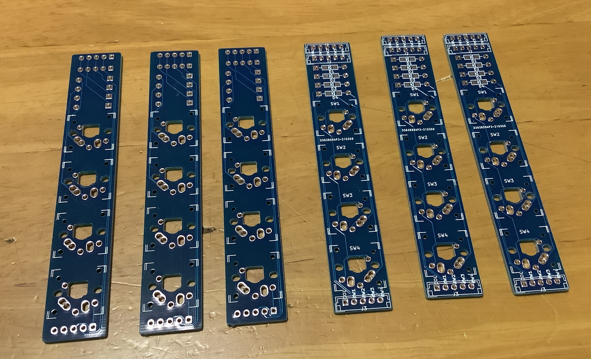
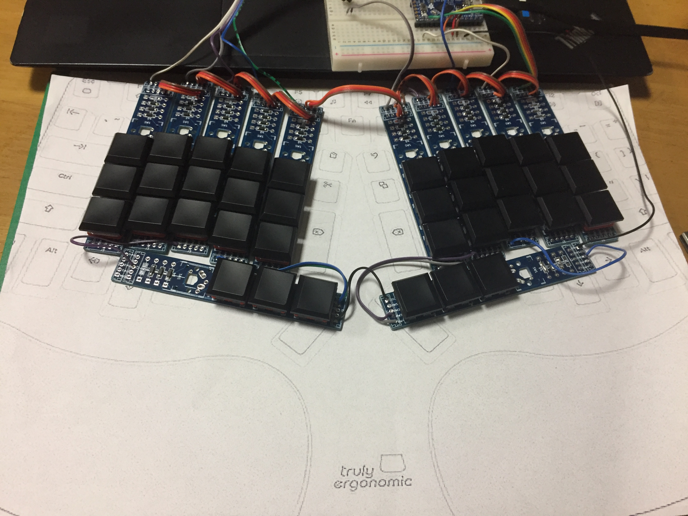
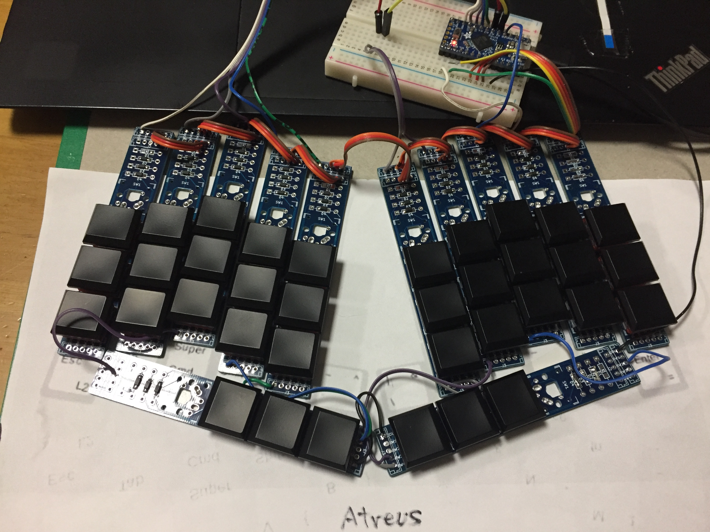
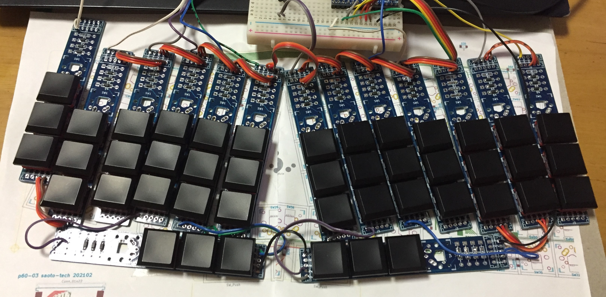
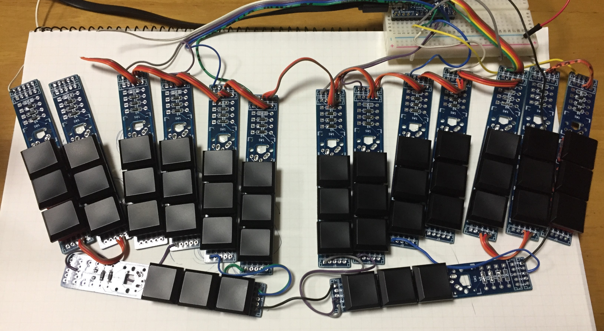
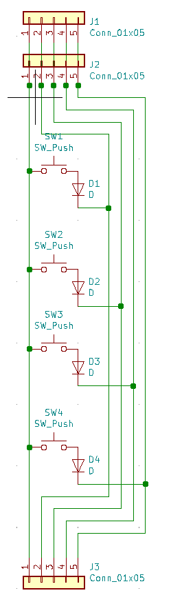
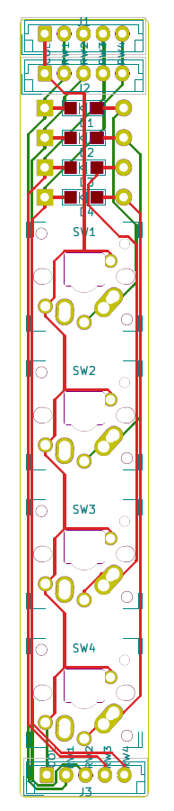
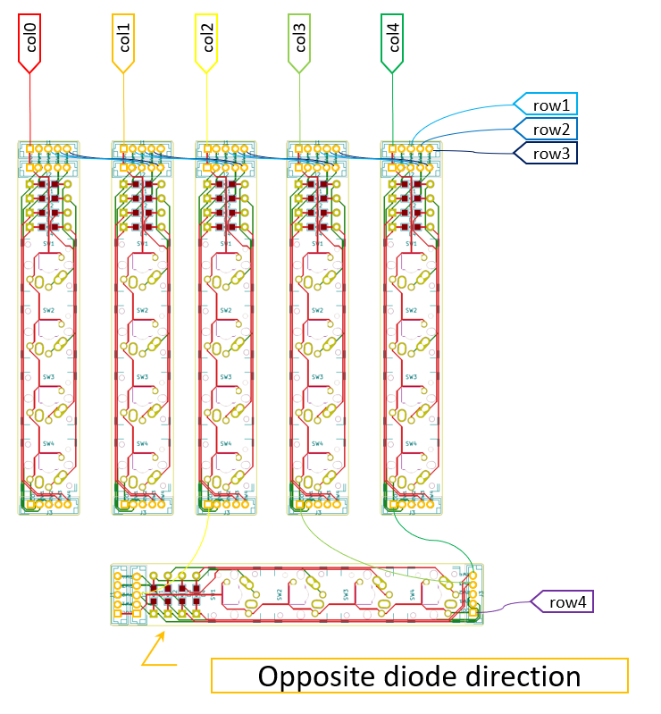
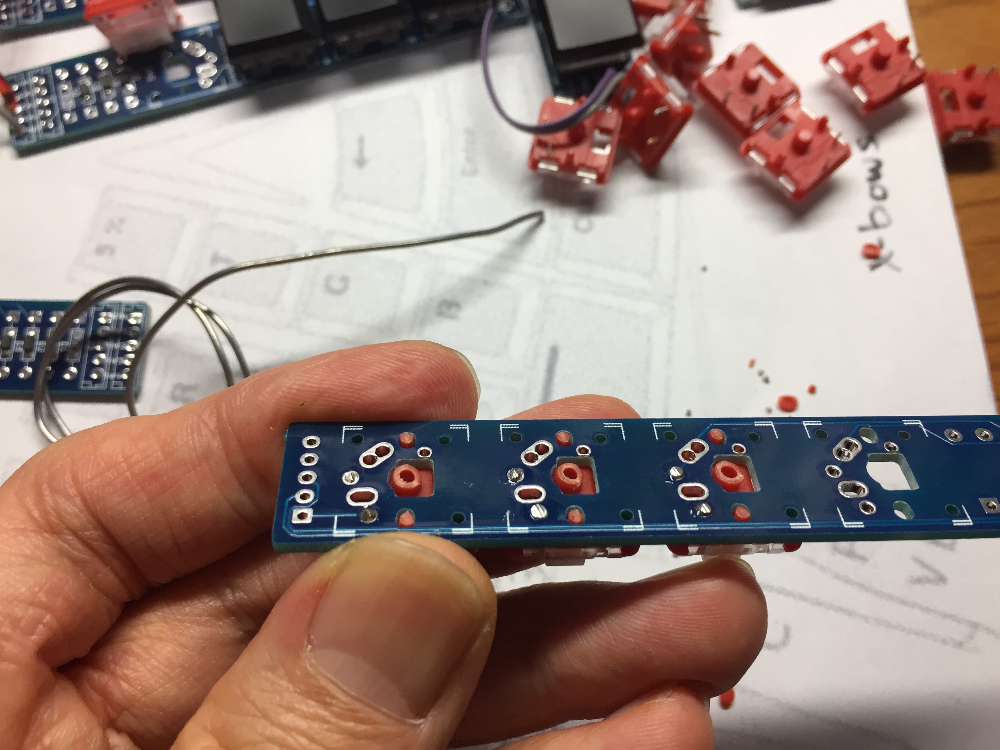
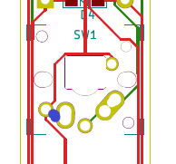

## p4
2020-03 key layout testing module

### X-BOWS like
I feel "T" and "Y" are far from the home position.

### truly ergonomic like

### Atreus like
I feel "B" and "N" are far from the home position.
And it is not easy to type "N->I" and "B->E".

### March's favorite

### New favorite - V style

[How to make V style](How_to_make_the_V-style.pdf)

### Drawing

### Example wiring connection

Cut the bottom protrusion of the choc key switches for making them flat.

When Cherry MX or Alps key switches are installed, connect the blue point on the drawing below.

