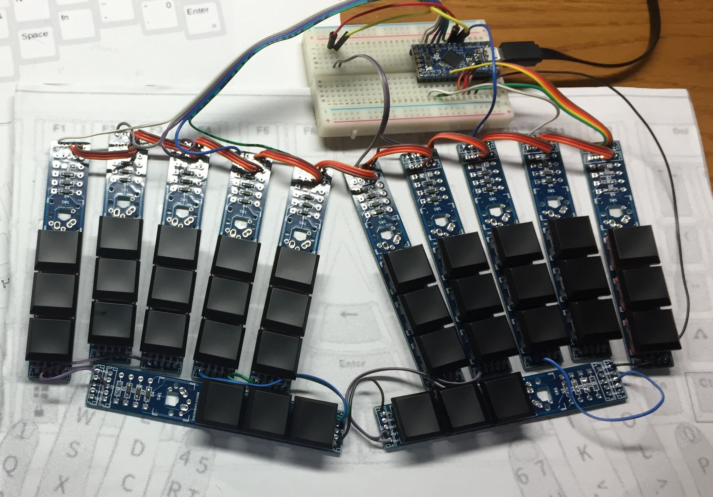

## p4
2020-03 key layout testing module

### Example wiring connection

Cut the bottom protrusion of the choc key switches for making them flat.

When Cherry MX or Alps key switches are installed, connect the blue point on the drawing below.

