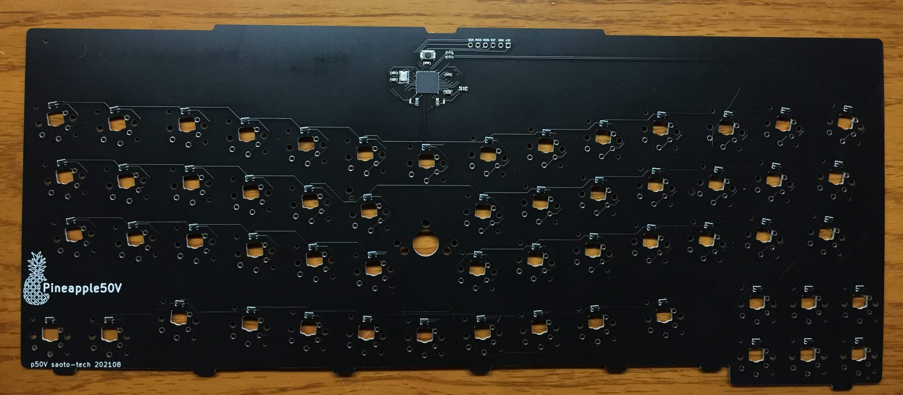

## p50V
2021-08 V-style layout for ThinkPad T470s

[Schmatic](p50v_sch.pdf)

[PCB](p50v_pcb.pdf)

Features:
- I decided on the V-style layout after testing various layouts with my variable layout keyboard.
- The MCU(Atmega 32u4) is directly installed on the PCB for making it thin. The MCU circuit was referred from the Itsybitsy 32u4.
- Connect the USB line to the port for the smart card reader inside the Thinkpad T470s.

- Give up the top row of key switches because of hitting the frame of the lid. 
- The key switches are the Kailh X-switches that I don't recommend. But, they are the only choice for the laptop.
- Though the key switches are still touching the LCD... I'm using this laptop for mobile.

Issues:
- The Kailh X-switch is not recommended, but no other choice.
- The Kailh X-switches still touch the LCD of the T470s.
- The direction of each key switch was unpopular on Reddit.
- I could flash my app after flashing the bootloader of Itsybitsy, only one time. I'm investigating why.