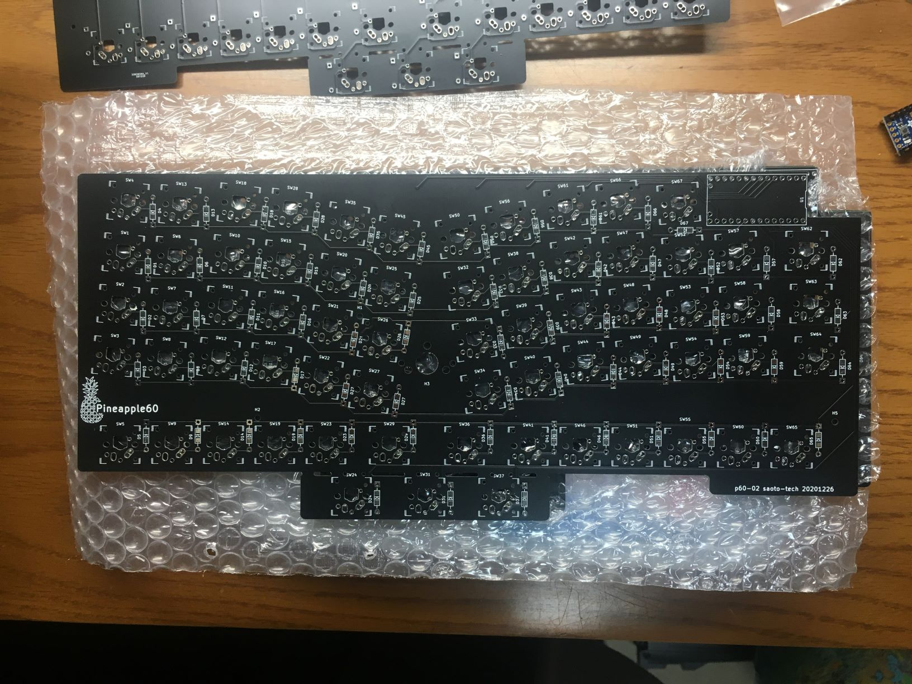

## p60-02
2020-12 second prototype pcb

Modifications from p60-01:
- Tilt the key layouts
- Less deformation from ortho-keyboard
- Move the Trackpoint position and MCU position

Current concerns :
- USB connection inside ThinkPad (for the Ergo ThinkPad)

- ~~Connection with the Trackpoint module (for the Ergo Keyboard)~~
- Combine the two USB connections between new board and original board (for the Ergo Keyboard)