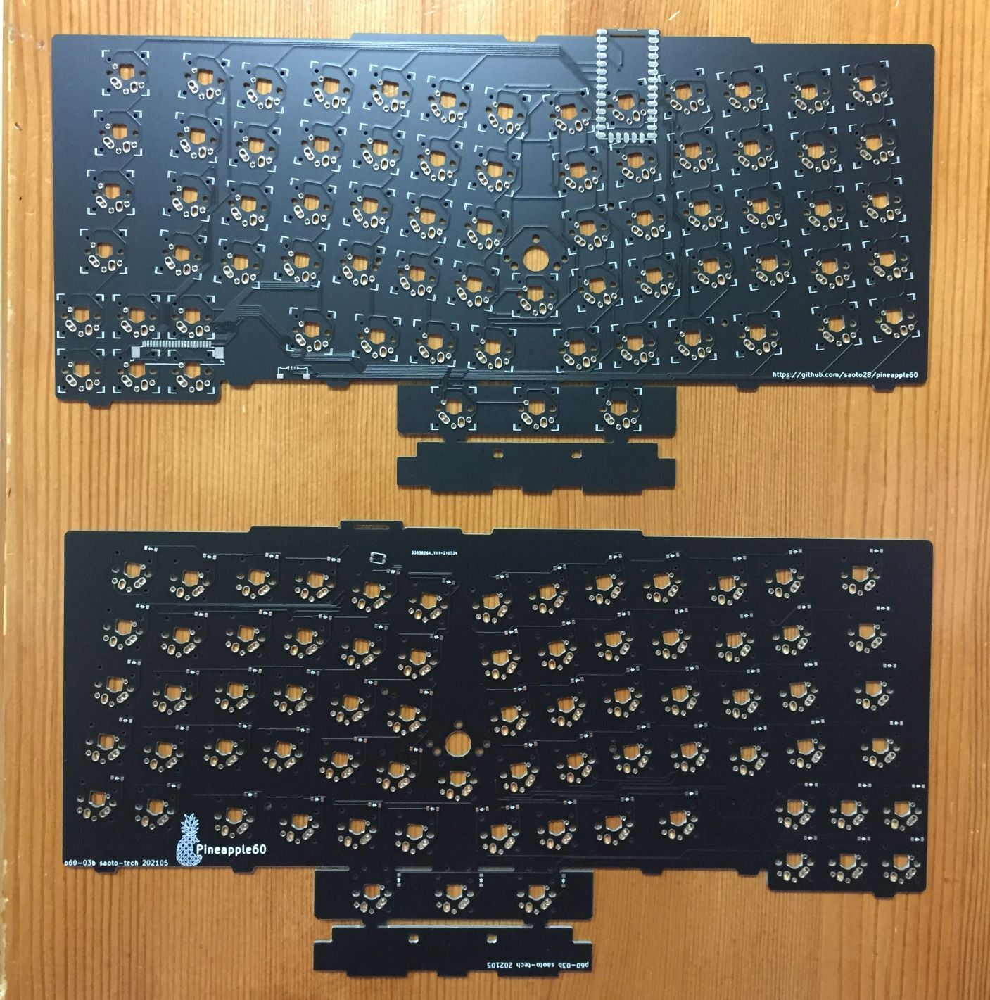

## p60-03b
2021-05 mod of p60-03

Modifications from p60-03:
- Only for installing the Thinkpad Trackpoint Keyboard KU-1255
- Change the THT pads to the SMD pads for the MCU
- Put a center key switch
- Fix some circuits for mouse buttons

[Schmatic](p60-03b_sch.pdf)

[PCB](p60-03b_pcb.pdf)

## p60-03
2021-04 third prototype pcb

Features
- For installing the Thinkpad T470s or Thinkpad Trackpoint keyboard KU-1255
- The MCU is Adafruit itsybitsy 32u4. It is put backside of the PCB for the Trackpoint keyboard, or put on an additional small plate fot the Thinkpad. 
- Compatible key switches: 
Kailh choc and X-switch, MX(unconfirmed), and ALPS(unconfirmed)

Modifications from p60-02:
- Modify the key layout according to trial results on p4 pcb 
- Put arrow keys
- Move the MCU backside for the Trackpoint keyboard
- Move the MCU to an additional small pcb for the Thinkpad
- Connect the USB line inside the Thinkpad through the small pcb

